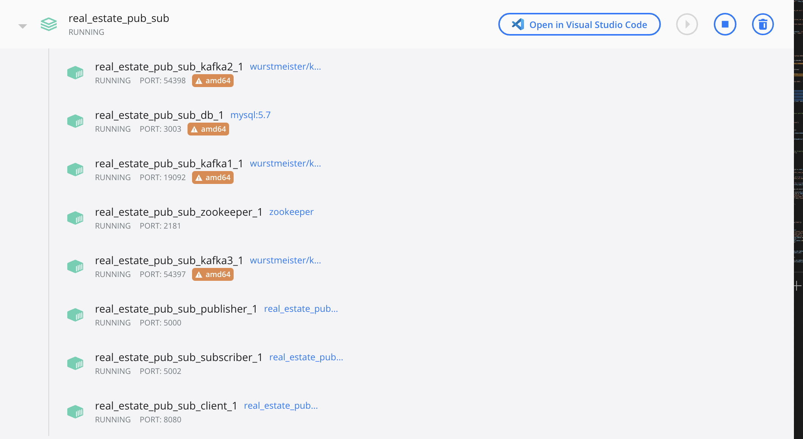
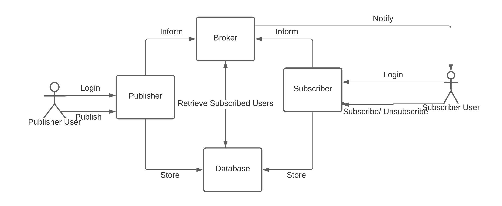
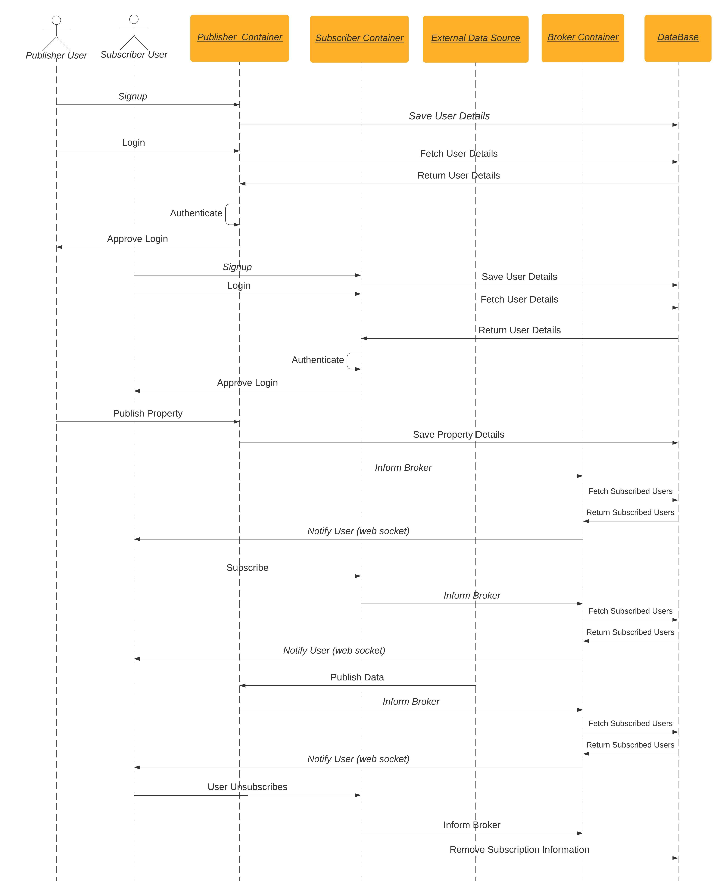
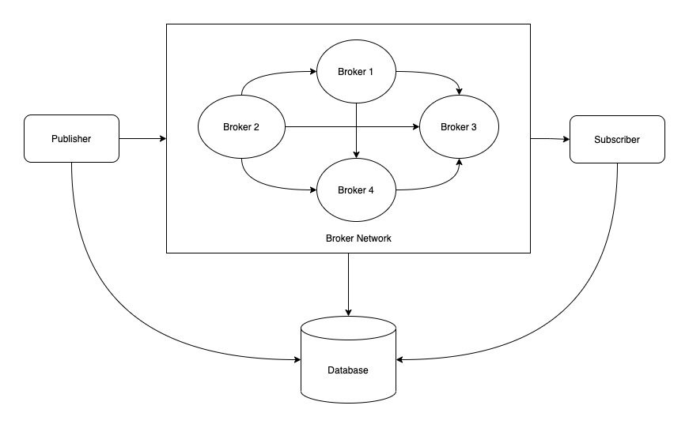

# Real Estate PubSub Model

**Introduction**

In the Real Estate Pub/Sub System, when a user subscribes to topics, the system notes the preferences of the subscriber and stores them for future use by the broker. Whenever a new property is added, the system will notify all the subscribed users.

**How to deploy the application**

1. Install Docker from the link based on your system preference ([https://docs.docker.com/get-docker/](https://docs.docker.com/get-docker/))
2. Open Terminal and switch to the parent path of the downloaded source code(real_estate_pub_sub)
3. This project uses ports 8080, 5000, 5002, 5005-5008 and 3003 on your local system hence ensure that these ports are free. In case they are used already use `lsof -i :<port number>` and kill the running port using `kill -9 <PID>` command from the terminal.
4. Hit `docker compose up` command to start the build and deploy the image

You find these images created for the client, publisher, subscriber, and database when you run `docker ps` command

Open a browser and enter http://localhost:8080/login to see the application running.

[Pre-populated Login Credentials](https://www.notion.so/214e3136b14c43eeb3d14f7e4fb1b85b)

You can log in using the above credentials. You can also Sign up as a new user.

**Architecture Diagram**

**Interaction Diagram**

**Publisher as a User**

- A publisher as a user can log in to the system and post new properties for sale based on the fields.
- Publisher can also view the list of all the properties which he posted
- He can inform his preference of posting from Manage Advertisement in settings.
- Advertise / De advertise can be done from this tab.

**Subscriber as a User**

- A subscriber user can log in to the system and show his topics of interest by subscribing/unsubscribing from the Manage Subscriptions panel.
- Users can view the list of properties of his interest and also the master list of properties.
- User will be notified in real-time using WebSocket connection if there is a new property posted in his topics of interest

**Publisher Container (Port: 5000)**

- Whenever a Publisher uses the app all the APIs will be to this server.
- This server hosts a list of API like which manages
  - Advertise/De advertise
  - Publishers Properties list (added by user)

**Subscriber Container (Port: 5002)**

- Whenever a Publisher uses the app all the APIs will be to this server.
- This server hosts a list of API like which manages
  - Subscribe/Unsubscribe
  - Subscribers Properties list (Based on topics he has subscribed to)
- The subscriber uses WebSocket to notify the users in real-time after getting the filtered list from the broker.

**Broker Container(Port: 5005-5008)**

- We’re implementing a centralized broker in our real estate pub/sub-model.
- The broker is responsible for filtering the data published by the publisher or External Data source and notifying the subscriber based on their subscriptions.

**Database Container(Port: 3003)**

- We use a MySQL database to store all the relevant Data.
- This is a centralized container that interacts with broker, subscriber, and publisher containers.
- The entity-relationship model can be found in the below image.

**Topics**

Topics for Subscription is based on two fields

1. Cities
   1. Buffalo
   2. Syracuse
   3. NYC etc.,
2. Room Types
   1. 1 BHK
   2. 2 BHK
   3. 3 BHK etc.,

**External Data Source**

For the External data source, we are using US real estate API provided by RAPID API ([https://rapidapi.com/datascraper/api/us-real-estate/](https://rapidapi.com/datascraper/api/us-real-estate/)) Using this API we fetch a few properties based on the filters which can be given as query params and populate it in the UI.

**Tech Stack**

Frontend → VueJS

User Authentication → Firebase

Database → MySQL

Server → Python + Flask

**Rendevous Implementation**

Going forward we now have deployed multiple instances of broker networks to distribute the load amongst them. To Distribute the load, each broker will be responsible for a specific set of topics where we have to ensure that at least one broker is responsible for a topic.

Whenever there is an event from the publisher it hits the broker whichever is up and running and this broker checks if he is responsible for the event if so then the Event will be processed by this broker. In case if he is responsible for the topic the Broker will get the list of brokers who are responsible for the topic and passes the event to the responsible broker. The responsible broker list can be more than one and this passes to the broker who has a connection with the current broker network.

Broker List and responsible topics(Cities):

- Broker 1 ⇒ Buffalo, Syracuse, Albany
- Broker 2 ⇒ NYC, Lancaster, Niagara Falls
- Broker 3 ⇒ Newark, Philadelphia, Boston
- Broker 4(Considered Backup) ⇒ Buffalo, NYC

We have an admin user role who can manage the topics handled by each of these brokers which can be found in the settings popover.
