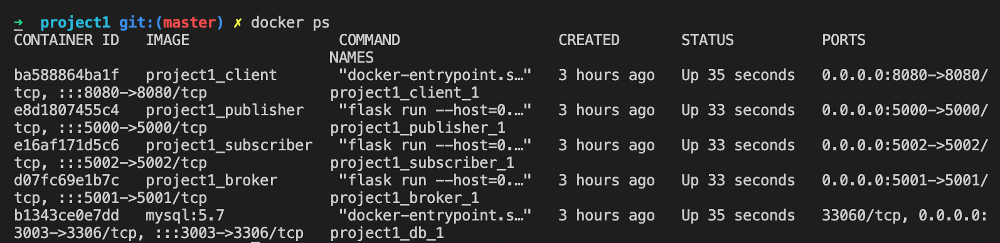

# Real Estate PubSub Model

**Introduction**

In the Real Estate Pub/Sub System, when a user subscribes to topics, the system notes the preferences of the subscriber and stores them for future use by the broker. Whenever a new property is added, the system will notify all the subscribed users.

**How to deploy the application**

1. Install Docker from the link based on your system preference ([https://docs.docker.com/get-docker/](https://docs.docker.com/get-docker/))
2. Open Terminal and switch to the parent path of the downloaded source code(real_estate_pub_sub)
3. This project uses ports 8080, 5000,5005,5002, and 3003 on your local system hence ensure these ports are free. In case they are used already use `lsof -i :<port number>` and kill the running port using `kill -9 <PID>` command from the terminal.
4. Hit `docker compose up` command to start the build and deploy the image

You find these images created for the client, publisher, subscriber, and database when you run `docker ps` command

Open a browser and enter http://localhost:8080/login to see the application running.

[Pre-populated Login Credentials](https://www.notion.so/214e3136b14c43eeb3d14f7e4fb1b85b)

You can log in using the above credentials. You can also Sign up as a new user.

**Architecture Diagram**

.jpeg>)

**Interaction Diagram**

.jpeg>)

**Publisher as a User**

- A publisher as a user can log in to the system and post new properties for sale based on the fields.
- Publisher can also view the list of all the properties which he posted
- He can inform his preference of posting from Manage Advertisement in settings.
- Advertise / De advertise can be done from this tab.

**Subscriber as a User**

- A subscriber user can log in to the system and show his topics of interest by subscribing/unsubscribing from the Manage Subscriptions panel.
- Users can view the list of properties of his interest and also the master list of properties.
- User will be notified in real-time using WebSocket connection if there is a new property posted in his topics of interest

**Publisher Container (Port: 5000)**

- Whenever a Publisher uses the app all the APIs will be to this server.
- This server hosts a list of API like which manages
  - Advertise/De advertise
  - Publishers Properties list (added by user)

**Subscriber Container (Port: 5002)**

- Whenever a Publisher uses the app all the APIs will be to this server.
- This server hosts a list of API like which manages
  - Subscribe/Unsubscribe
  - Subscribers Properties list (Based on topics he has subscribed)

**Broker Container(Port: 5005)**

- We’re implementing a centralized broker in our real estate pub/sub-model.
- The broker is responsible for filtering the data published by the publisher or External Data source and notifying the subscriber based on their subscriptions.
- The broker uses WebSocket to notify the subscribers in real-time after filtering the users.

**Database Container(Port: 3003)**

- We use a MySQL database to store all the relevant Data.
- This is a centralized container that interacts with broker, subscriber and publisher containers.
- Entity–relationship model can be found in the below image.

.jpeg>)

**Topics**

Topics for Subscription is based on two fields

1. Cities
   1. Buffalo
   2. Syracuse
   3. NYC etc.,
2. Room Types
   1. 1 BHK
   2. 2 BHK
   3. 3 BHK etc.,

**External Data Source**

For the External data source, we are using US real estate API provided by RAPID API ([https://rapidapi.com/datascraper/api/us-real-estate/](https://rapidapi.com/datascraper/api/us-real-estate/)) Using this API we fetch a few properties based on the filters which can be given as query params and populate it in the UI.

**Tech Stack**

Frontend → VueJS

User Authentication → Firebase

Database → MySQL

Server → Python + Flask
